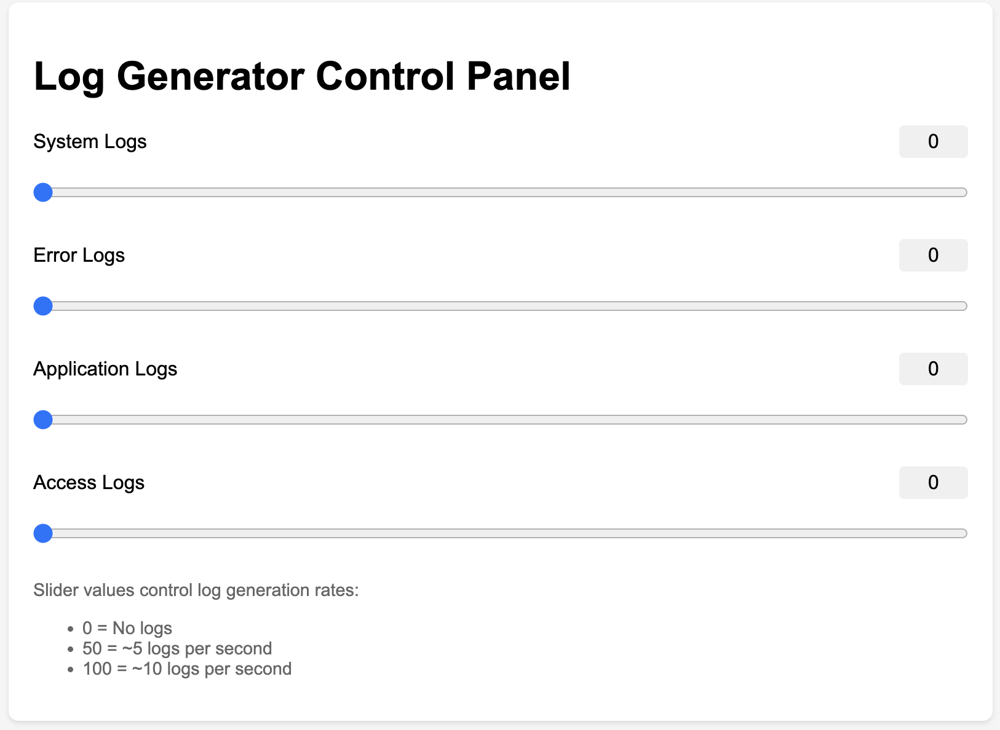

# Log Aggregation Data Generator

This is a test data generator for log aggregation data. It can be used to generate log files for testing purposes in log aggregation systems. Dummy data keeps appending to the log files, hence the logs can be tail'ed and using the sliders, the composition of the logs can be changed. A future enhancement will be to have the events published to a Kafka topic. 

Test data writing is done in a separate thread to prevent the main thread from blocking.

## How to get ready
1. Clone the repository: `git clone https://github.com/hrmeetsingh/LogAggregation.git`
2. Navigate to the repository directory: `cd LogAggregation`
3. Create a virtual environment: `python3 -m venv venv`
4. Activate the virtual environment: `source venv/bin/activate`
5. Install the required dependencies: `pip install -r requirements.txt`
6. Run the Web Application: `python app.py`

## How to use

1. Open a web browser and navigate to http://localhost:5000. The Log Generator Control Panel will be displayed.
2. Adjust the sliders to change the log generation rates. The slider values control log generation rates:
    - 0 = No logs
    - 50 = ~5 logs per second
    - 100 = ~10 logs per second 
3. Four log files will be created in the logs directory:
    - system.log
    - error.log
    - application.log
    - access.log

## How to stop
1. Press Ctrl+C to stop the log writer thread

## How to clean up
1. Deactivate the virtual environment: `deactivate`
2. Remove the virtual environment directory: `rm -rf venv`
